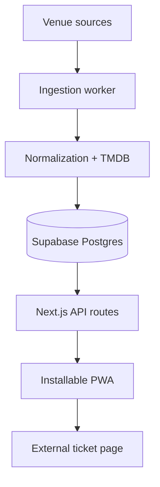

# Step 1 — System Architecture

## Architectural shape

The project is a TypeScript monorepo with three runtime boundaries:

1. **Web PWA** — Next.js App Router renders the mobile-first browsing experience and exposes read-only internal API routes.
2. **Ingestion worker** — scheduled Node.js jobs fetch raw venue schedules, normalize records, enrich movies through TMDB, and upsert canonical entities.
3. **PostgreSQL** — Supabase stores source provenance, canonical movies, venue screenings, tags, and ingestion history.



The web application never calls venue systems or TMDB directly. The ingestion worker is the only writer for schedule data. The client receives normalized, cacheable projections from internal API routes.

## Repository structure

```text
vancouver-indie-cinema/
├── apps/
│   ├── web/                         # Next.js App Router PWA
│   │   ├── app/
│   │   │   ├── api/showtimes/       # Upcoming showtimes for N Vancouver days
│   │   │   ├── api/movies/today/    # The rest of today
│   │   │   ├── manifest.ts          # Web App Manifest
│   │   │   └── page.tsx             # Server-rendered listing (ISR, 5 minutes)
│   │   ├── components/              # Client UI and service-worker registration
│   │   ├── lib/                     # Shared Postgres client, projections, demo data
│   │   └── public/                  # Icons and the service worker
│   └── worker/                      # Node.js ingestion service
│       ├── src/
│       │   ├── extractors/          # One venue adapter per source
│       │   ├── normalization/       # Title rules, TMDB ranking, repository
│       │   └── jobs/ingest.ts       # Run orchestration and reconciliation
│       └── test/                    # Vitest suites with fixture HTML/JSON
├── supabase/migrations/             # Versioned PostgreSQL migrations and venue seed
└── docs/                            # Architecture and source findings
```

## Data flow and identity

1. An extractor emits a `raw_source_items` record with the original payload and a stable source key.
2. A deterministic normalization pass extracts a core title, optional year, event flags, and confidence. The rules version and full output are retained on the raw item so a rules change can be replayed and audited.
3. TMDB candidates are evaluated. Automatic linking requires a configurable confidence threshold; uncertain records remain reviewable instead of being forced into a wrong movie.
4. A canonical `movies` row is created or reused. A partial unique index ensures one row per TMDB movie.
5. A `showtimes` row links the movie, theatre, and source item. Its external ticket URL is the only purchase CTA.
6. Format and experience labels such as `35mm`, `Q&A`, `Live Score`, or `Members Only` are normalized into reusable `tags` joined through `showtime_tags`.

`showtimes.source_uid` is the ingestion idempotency key. It is derived from the venue's stable event/session ID when available, not from display text. Each run marks currently observed rows active. When an extraction completes without warnings, future showtimes it no longer lists are marked inactive rather than deleted, so history survives and a partial fetch can never hide a whole schedule.

## Ingestion job

`apps/worker/src/jobs/ingest.ts` runs every venue concurrently and isolates failures per venue. Each venue gets an `ingestion_runs` row that records fetched, upserted, and error counts plus a metadata summary; every `raw_source_items` revision points back to the run that produced it. Only Rio accepts a date range, so the horizon (`--days`, default 60) bounds both that request and the reconciliation window.

## Relational model

| Table | Responsibility |
|---|---|
| `theatres` | Venue identity, location, timezone, and source configuration |
| `movies` | One canonical film entity, preferably linked to TMDB |
| `raw_source_items` | Immutable-ish source evidence and normalization audit trail |
| `showtimes` | A scheduled screening with ticket deep-link and lifecycle status |
| `tags` | Controlled metadata vocabulary such as formats and special events |
| `showtime_tags` | Many-to-many association with optional source text |
| `ingestion_runs` | Per-source operational history and counts |

Important choices:

- **Special events are modeled as tags, not a parallel event table.** A Q&A or 35mm presentation remains attached to a screening and composes naturally with other tags. A future non-film event can use `showtimes.kind = 'special_event'` with a nullable movie.
- **Movie and showtime data are separated.** Multiple theatres can point to one TMDB-backed movie while retaining distinct times, auditoria, ticket links, and tags.
- **Raw source evidence is retained.** Parser and normalization changes can be replayed without immediately refetching a venue.
- **Timestamps use `timestamptz`.** Venue-local presentation uses the theatre's IANA timezone (`America/Vancouver` by default).
- **No ticket inventory is represented.** Availability is informational and the authoritative action is always the external URL.

## PWA and caching boundary

The service worker should precache the application shell and use stale-while-revalidate for poster images. Schedule API responses should use network-first with a bounded cached fallback and display a visible “last updated” timestamp. Ticket URLs must never be treated as usable offline; the UI should explain that connectivity is required to continue to the theatre.

## Security and operations

- Browser clients receive only read access to published schedule projections.
- Database and TMDB credentials remain server-only; the browser only receives read projections.
- Extraction payloads are untrusted input and must be schema-validated before persistence.
- Raw payload retention should be bounded by a cleanup policy once replay requirements are understood.
- Logs should include `ingestion_run_id`, `theatre_id`, and source identifiers, but never credentials or full request headers.
- Row Level Security should deny anonymous writes. Public reads can later be exposed through a constrained view or server API.

## Deliberately deferred

This document was written before implementation. Extractors, normalization rules, TMDB thresholds, API routes, UI, and the service worker now exist under `apps/`; CI, scheduled invocation of the worker, and deployment remain to be set up.
